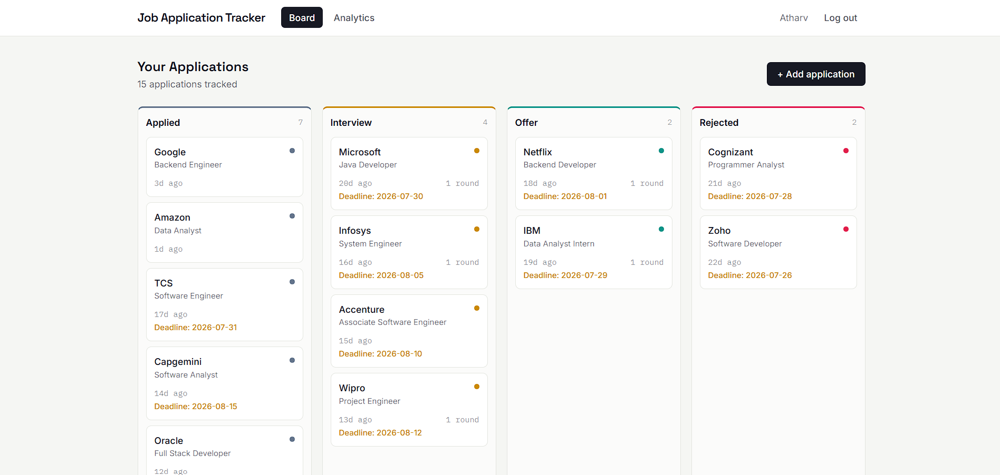
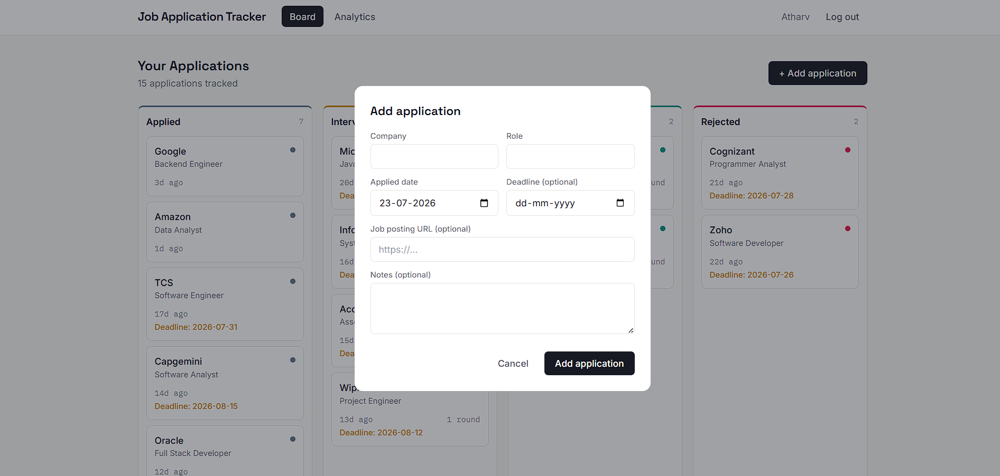
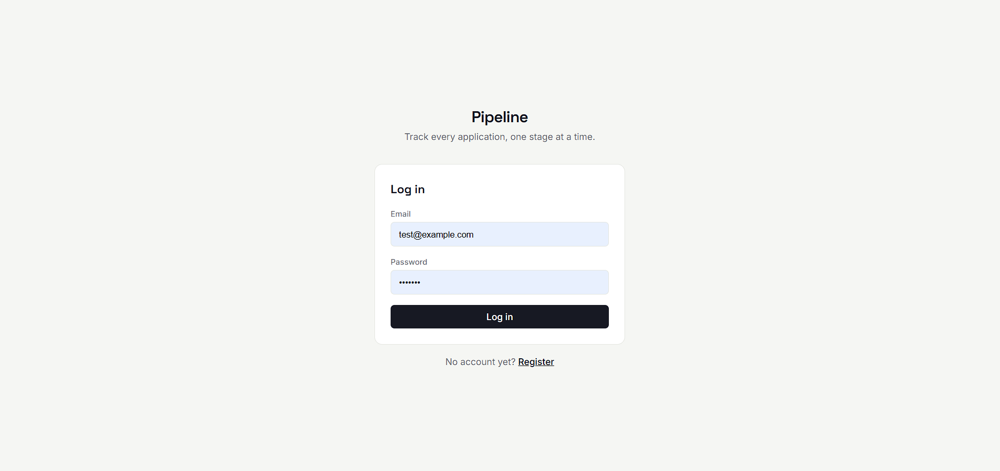

# Job Application Tracker

A full-stack web application for tracking job applications, managing interview rounds, and analyzing job search performance through an interactive dashboard.

I built this while I was in the middle of my own job search — I was tracking applications in a messy spreadsheet and got tired of it, so I decided to build something better and use it as a chance to properly learn Spring Boot alongside React.
## Features

- JWT Authentication & Authorization
- Job Application Management
- Interview Round Tracking
- Analytics Dashboard
- Kanban-style Application Board
- Drag-and-Drop Status Updates
- PostgreSQL / H2 Database Support

## Tech Stack

**Backend**
- Java 17
- Spring Boot
- Spring Security
- Spring Data JPA
- Hibernate
- JWT

**Frontend**
- React
- Vite
- Tailwind CSS
- Recharts

**Database**
- PostgreSQL
- H2

## Quick Start

### Backend

```bash
cd backend
mvn spring-boot:run
```

Runs on:

```text
http://localhost:8080
```

### Frontend

```bash
cd frontend
npm install
npm run dev
```

Runs on:

```text
http://localhost:5173
```

## Screenshots


## Screenshots

| Dashboard | Analytics |
|------------|------------|
|  |  |

| Add Application | Login |
|------------|------------|
|  |  |
## Key Highlights

- Built a full-stack application using Spring Boot and React.
- Implemented JWT-based authentication.
- Developed analytics for interview and offer conversion rates.
- Used JPA/Hibernate with optimized fetch queries.
- Designed a Kanban-style job application workflow.

## Author

**Atharv Sanjay Gade**